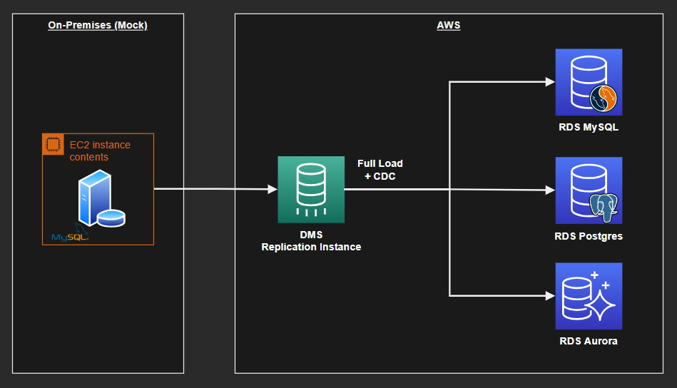

# AWS Data Migration Service (DMS)

Migration sandbox from a mocked on-premises MySQL database to AWS RDS, for both RDS Aurora and RDS MySQL as target destinations.



## Crete the source database

Create the EC2 source database infrastructure:

```sh
terraform -chdir='ec2-mysql' init
terraform -chdir='ec2-mysql' apply -auto-approve
```

MySQL will be installed and running via user-data.

Log into the VM using SSM.

Use `sudo mysql` and execute the contexts of file [`prepare-database-.sql`](ec2-mysql/prepare-database-.sql) available in this repository. You can use your favorite SQL editor at this point too.

Once the objects are created, execute the procedure to populate the table.

```sql
CALL populate();
```

The database now have items to be replicated to RDS.

## Create the migration resources

This will create the migration instance, and the RDS MySQL and RDS Aurora.

First create the variables:

```sh
touch aws-dms/.auto.tfvars

# Add the source endpoint - it can be the IP or DNS
ec2_mysql_endpoint = "<source-endpoint>"
```

Create the infrastructure:

```sh
terraform -chdir='aws-dms' init
terraform -chdir='aws-dms' apply -auto-approve
```

Once done, connect to the console test the endpoint connections.

https://sa-east-1.console.aws.amazon.com/dms/v2/home?region=sa-east-1#endpointList

If the endpoint connections tests are successful, replication is ready to start. Move to the DMS migration tasks blade and start the migrations.

https://sa-east-1.console.aws.amazon.com/dms/v2/home?region=sa-east-1#tasks

All tasks once started should run successfully:


## Clean-up

Delete the infrastructure to avoid costs:

```sh
terraform -chdir='aws-dms' destroy -auto-approve
terraform -chdir='ec2-mysql' destroy -auto-approve
```
